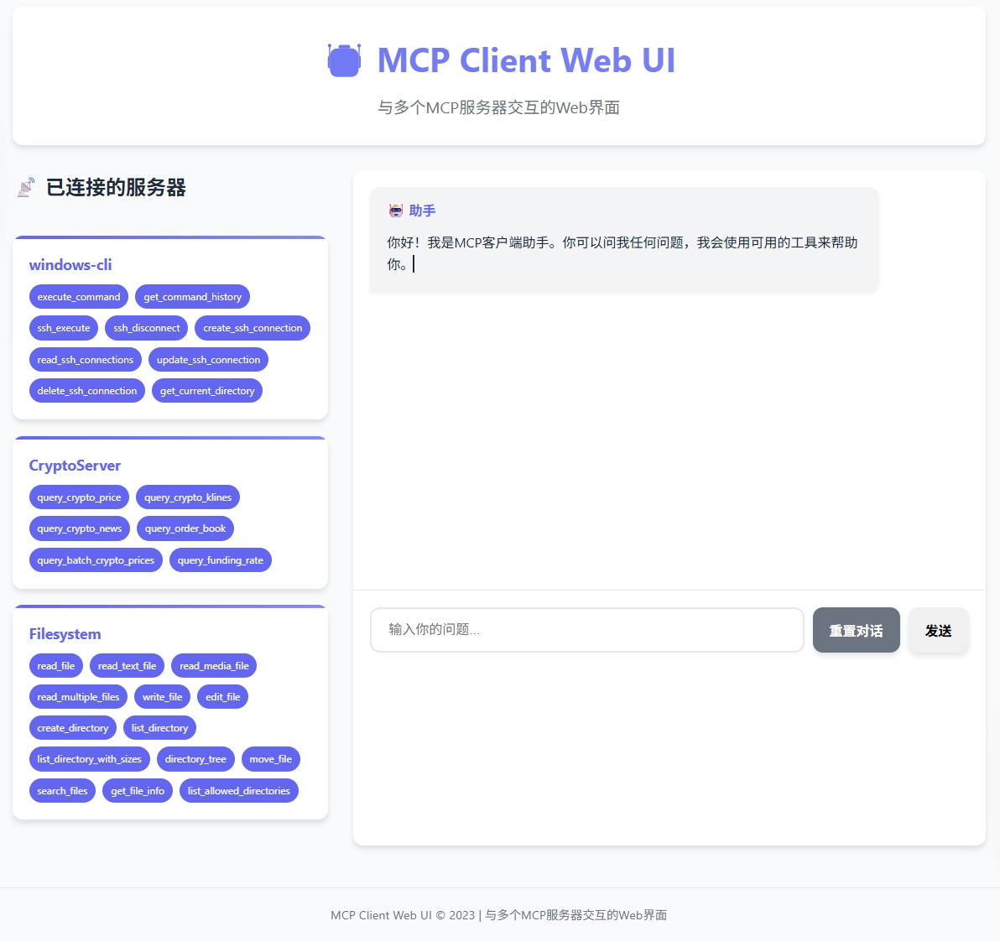

# Crypto MCP Server 🚀

加密货币市场数据MCP服务器，提供实时价格、K线数据、资金费率和行业新闻查询功能。采用模块化设计，支持多数据源集成和工具扩展，适用于量化交易分析、市场监控和加密货币研究。

## ✨ 核心功能
- **实时价格查询**：支持单个/批量加密货币价格获取，数据来源于币安交易所
- **K线数据分析**：提供多种时间周期（1m-1M）的历史K线数据，包含开盘价、最高价、最低价、收盘价和交易量
- **资金费率监控**：永续合约资金费率历史数据查询，支持自定义获取数量
- **行业新闻聚合**：整合Odaily新闻源，提供今日/昨日加密货币行业动态和重要资讯
- **性能优化**：内置请求缓存机制，减少重复API调用，提升响应速度
- **灵活扩展**：模块化架构设计，新增数据源或工具仅需实现对应接口

## 📂 项目结构详解

| 文件名 | 类型 | 描述 | 核心功能 |
|--------|------|------|---------|
| `crypto_mcp_server.py` | 主程序 | 加密货币MCP服务器核心实现 | 注册工具、处理请求、API调用、数据格式化 |
| `mcp_client.py` | 客户端库 | MCP协议客户端实现 | 连接服务器、调用工具、处理响应、错误处理 |
| `weather_mcp_server.py` | 示例模块 | 天气查询MCP服务器 | 演示如何扩展实现新的MCP服务 |
| `config.json` | 配置文件 | 应用程序配置参数 | API密钥、超时设置、缓存策略、日志级别 |
| `mcp.json` | 服务配置 | MCP服务器启动配置 | 服务端口、传输方式、并发设置、日志路径 |
| `requirements.txt` | 依赖文件 | 项目依赖包列表 | 包含httpx、python-dotenv、pydantic等依赖 |

### 核心模块详细说明
#### 🚀 crypto_mcp_server.py
- **数据获取层**：`fetch_crypto_price`, `fetch_crypto_klines`等异步函数，负责从交易所API获取原始数据
- **数据格式化层**：`format_crypto_data`, `format_crypto_klines`等函数，将原始数据转换为用户友好的文本格式
- **工具注册层**：使用`@mcp.tool()`装饰器注册工具，定义工具名称、参数和功能描述
- **主程序入口**：支持标准I/O运行模式，可通过`mcp.run(transport='stdio')`启动服务

#### 🔧 mcp_client.py
- **连接管理**：自动处理与MCP服务器的连接建立和维护
- **工具调用**：提供简洁的`call()`方法，支持位置参数和关键字参数传递
- **响应处理**：内置错误处理和数据解析，返回格式化结果
- **批量操作**：支持同时调用多个工具，提高处理效率

## 🚀 快速开始指南

### 环境要求
- Python 3.8+ 

### 安装步骤
```bash
git clone https://github.com/Ibook000/crypto_mcp_server.git
cd crypto_mcp_server
python crypto_mcp_server.py
```

### 客户端使用示例
```python
from mcp_client import MCPClient

# 初始化客户端
client = MCPClient()

# 查询单个加密货币价格
btc_price = client.call("query_crypto_price", symbol="BTCUSDT")
print(btc_price)

# 批量查询价格
prices = client.call("query_batch_crypto_prices", symbols=["BTCUSDT", "ETHUSDT", "BNBUSDT"])
print(prices)

# 查询K线数据
klines = client.call("query_crypto_klines", symbol="BTCUSDT", interval="1h", limit=24)
print(klines)

# 查询资金费率
funding_rates = client.call("query_funding_rate", symbol="BTCUSDT", limit=7)
print(funding_rates)

# 获取今日新闻
news = client.call("query_crypto_news", length=0)
print(news)
```

### Web UI 使用
项目包含一个基于FastAPI的Web界面，提供图形化交互体验：

1. 安装额外依赖：
```bash
pip install -r requirements.txt
```

2. 启动Web服务器：
```bash
python webui_fastapi.py
```

3. 在浏览器中访问 `http://localhost:8000`

Web UI特性：
- 🖥️ 图形化聊天界面
- 📡 实时显示已连接的MCP服务器和可用工具（支持自由添加MCP服务器）
- 💬 对话历史记录和重置功能
- 🌐 响应式设计，支持移动设备




## 🛠️ 工具参数详解

### 1. query_crypto_price
获取单个加密货币的实时价格
- **参数**：`symbol` (str) - 交易对符号，如"BTCUSDT"
- **返回**：格式化的价格信息字符串
- **示例**：`query_crypto_price(symbol="BTCUSDT")`

### 2. query_batch_crypto_prices
批量获取多个加密货币的实时价格
- **参数**：`symbols` (list) - 交易对符号列表，如["BTCUSDT", "ETHUSDT"]
- **返回**：格式化的批量价格信息字符串
- **示例**：`query_batch_crypto_prices(symbols=["BTCUSDT", "ETHUSDT"])`

### 3. query_crypto_klines
获取加密货币的历史K线数据
- **参数**：
  - `symbol` (str) - 交易对符号
  - `interval` (str) - 时间周期，可选值：1m, 3m, 5m, 15m, 30m, 1h, 2h, 4h, 6h, 8h, 12h, 1d, 3d, 1w, 1M
  - `limit` (int) - 获取数量，1-1000，默认100
- **返回**：格式化的K线数据表格
- **示例**：`query_crypto_klines(symbol="BTCUSDT", interval="1h", limit=24)`

### 4. query_funding_rate
获取永续合约的资金费率历史数据
- **参数**：
  - `symbol` (str) - 永续合约交易对符号
  - `limit` (int) - 获取数量，1-1000，默认10
- **返回**：格式化的资金费率历史数据
- **示例**：`query_funding_rate(symbol="BTCUSDT", limit=7)`

### 5. query_crypto_news
获取加密货币行业新闻
- **参数**：`length` (int) - 0表示今日新闻，1表示昨日新闻，默认0
- **返回**：格式化的新闻摘要列表
- **示例**：`query_crypto_news(length=0)`

### 6. query_crypto_news_search
通过NewsAPI搜索加密货币相关新闻
- **参数**：
  - `query` (str) - 搜索关键词，如"bitcoin", "ethereum", "加密货币"
  - `api_key` (str, 可选) - NewsAPI的API密钥，如果不提供则跳过此工具
  - `language` (str, 可选) - 语言代码，默认"zh"，可选"en"
  - `sort_by` (str, 可选) - 排序方式，默认"publishedAt"，可选"relevancy", "popularity"
  - `page_size` (int, 可选) - 返回新闻数量，默认10，最大100
- **返回**：格式化的新闻搜索结果列表
- **使用前提**：需要先在NewsAPI注册获取API密钥（免费）
- **注册地址**：https://newsapi.org/register
- **示例**：`query_crypto_news_search(query="bitcoin", api_key="your_api_key_here")`

## 📝 详细示例输出

### 价格查询
```
交易对: BTCUSDT
价格: 30000.00000000 USDT
```

### 批量价格查询
```
📊 批量价格查询结果：
交易对: BTCUSDT
价格: 30000.00000000 USDT
交易对: ETHUSDT
价格: 1800.00000000 USDT
交易对: BNBUSDT
价格: 300.00000000 USDT
```

### K线数据
```
🕰️ K线数据列表（时间从旧到新）：
时间                 开盘       最高       最低       收盘       交易量
--------------------------------------------------------------------
2023-07-01 00:00:00  29800.00   30200.00   29700.00   30000.00   1250.50
2023-07-01 01:00:00  30000.00   30500.00   29900.00   30300.00   980.75
2023-07-01 02:00:00  30300.00   30400.00   30000.00   30100.00   750.25
```

### 资金费率
```
资金费率历史数据（时间从旧到新）：
时间                 交易对     资金费率      收取时间
----------------------------------------------------
2023-06-28 08:00:00  BTCUSDT     0.0125%  2023-06-29 08:00:00
2023-06-29 08:00:00  BTCUSDT     0.0150%  2023-06-30 08:00:00
2023-06-30 08:00:00  BTCUSDT     0.0100%  2023-07-01 08:00:00
```

### 加密货币新闻
```
加密货币新闻摘要：
【快讯】标题：比特币突破30000美元关口
简介：比特币价格今日上涨5%，突破30000美元重要阻力位，市场情绪回暖。
发布时间：2023-07-01 10:30:00
源网址：https://www.odaily.news/news/12345

【文章】标题：以太坊合并后生态系统发展分析
摘要：本文详细分析了以太坊合并后三个月的生态系统变化，包括DeFi、NFT和Layer2的发展情况。
发布时间：2023-07-01 09:15:00
源网址：https://www.odaily.news/post/67890
```

## 🔧 开发指南

### 项目架构
本项目采用分层架构设计：
1. **接口层**：MCP工具定义和注册
2. **业务逻辑层**：数据处理和格式化
3. **数据访问层**：API请求和响应处理
4. **基础设施层**：配置管理、日志和错误处理

### 速率限制处理
MCP客户端现在内置了智能的速率限制处理机制：

#### 🔄 重试机制特性
- **指数退避**：遇到429错误时自动采用指数退避算法
- **随机抖动**：添加随机延迟避免同步重试风暴
- **可配置参数**：通过config.json配置重试参数
- **智能识别**：自动识别OpenAI API的速率限制错误

#### ⚙️ 配置参数
在`config.json`中添加以下参数：
```json
{
    "max_retries": 3,
    "retry_delay": 1,
    "max_delay": 60
}
```

- **max_retries**: 最大重试次数（默认3次）
- **retry_delay**: 基础重试延迟时间（秒）
- **max_delay**: 最大重试延迟时间（秒）

#### 📊 错误处理流程
1. **首次失败**：等待基础延迟时间后重试
2. **二次失败**：等待指数增长的延迟时间
3. **最终失败**：达到最大重试次数后返回友好错误信息

#### 🛡️ 使用示例
当API达到速率限制时，客户端会自动处理：
```
⚠️ 速率限制错误 (尝试 1/4)，等待 1.5秒后重试...
⚠️ 速率限制错误 (尝试 2/4)，等待 3.2秒后重试...
⚠️ 速率限制错误 (尝试 3/4)，等待 7.8秒后重试...
❌ 达到最大重试次数 (4)，放弃重试
```

### 🧠 对话记忆功能
MCP客户端现在支持对话历史记忆，能够在多轮对话中保持上下文：

#### 🔄 功能特性
- **上下文保持**：自动保存对话历史，提供连贯的对话体验
- **智能管理**：自动管理对话历史，避免token过长问题
- **手动重置**：支持通过输入`reset`命令清除对话历史

#### 📝 使用方法
在交互模式下，客户端会自动记住之前的对话内容：
```
😊: 你好
🤖: 你好！有什么我可以帮你的吗？

😊: 我想查询比特币的价格
🤖: 正在查询比特币的价格...

😊: 还能告诉我以太坊的价格吗？
🤖: 正在查询以太坊的价格...
```

#### 🔄 重置对话
输入`reset`命令可以清除对话历史：
```
😊: reset
🔄 对话历史已清除
```

#### ⚙️ 技术实现
- **conversation_history**：在MCPClient类中维护对话历史列表
- **process_query**：在处理查询时使用完整的对话历史
- **reset_conversation**：提供清除对话历史的方法

### 配置NewsAPI新闻搜索功能

#### 🔑 获取API密钥
要使用`query_crypto_news_search`功能，需要先获取NewsAPI密钥：
1. 访问 https://newsapi.org/register 注册账号（免费）
2. 登录后获取API密钥
3. 将密钥添加到配置文件中

#### ⚙️ 配置方法

**方法1：通过mcp.json配置**
在`mcp.json`文件中添加环境变量配置：
```json
{
    "mcpServers": {
        "crypto": {
            "command": "python",
            "args": [
            "crypto_mcp_server.py",
            "--NEWS_API_KEY", 
            "your_newsapi_key_here"
            ],
        }
    }
}
```

**方法2：通过环境变量**
在启动服务器前设置环境变量：
```bash
# Windows
set NEWS_API_KEY=your_newsapi_key_here
python crypto_mcp_server.py

# Linux/Mac
export NEWS_API_KEY=your_newsapi_key_here
python crypto_mcp_server.py
```

**方法3：通过config.json配置**
在`config.json`中添加配置：
```json
{
    "news_api_key": "your_newsapi_key_here",
    "max_retries": 3,
    "retry_delay": 1,
    "max_delay": 60
}
```

#### 📋 使用示例

**基本使用**：
```python
# 搜索比特币相关新闻
news = client.call("query_crypto_news_search", 
                   query="bitcoin", 
                   api_key="your_api_key_here")
print(news)

# 搜索中文加密货币新闻
news = client.call("query_crypto_news_search", 
                   query="加密货币", 
                   api_key="your_api_key_here", 
                   language="zh", 
                   page_size=5)
print(news)
```

**不配置API密钥的情况**：
如果未配置API密钥，新闻搜索工具将不会注册，调用时会提示：
```
❌ 新闻搜索功能需要配置NewsAPI密钥
```

### 添加新工具步骤
1. **实现数据获取函数**：在`crypto_mcp_server.py`中添加新的异步数据获取函数
```python
async def fetch_new_data(param1, param2):
    # 实现API调用逻辑
    pass
```

2. **实现格式化函数**：创建数据格式化函数，将原始API响应转换为用户友好的格式
```python
def format_new_data(data):
    # 实现数据格式化逻辑
    pass
```

3. **注册新工具**：使用`@mcp.tool()`装饰器注册新工具
```python
@mcp.tool()
async def query_new_tool(param1, param2):
    """工具描述"""
    data = await fetch_new_data(param1, param2)
    return format_new_data(data)
```

4. **更新文档**：在README.md中添加新工具的参数说明和使用示例

### 性能优化建议
- **缓存策略**：对于频繁访问的静态数据，可增加缓存机制
- **批量请求**：尽量使用批量API接口减少请求次数
- **异步处理**：保持I/O操作的异步特性，避免阻塞事件循环
- **连接池**：使用HTTP连接池复用TCP连接，减少握手开销

## ⚠️ 故障排除

### 常见问题及解决方法
1. **API请求失败**
   - 检查网络连接和防火墙设置
   - 验证API密钥是否正确配置
   - 查看API提供商的状态页面，确认服务是否正常

2. **数据格式错误**
   - 检查参数是否符合API要求（如交易对格式、时间周期等）
   - 确认API响应格式是否有变化
   - 查看日志文件获取详细错误信息

3. **服务器启动失败**
   - 检查端口是否被占用
   - 验证依赖包是否正确安装
   - 检查配置文件格式是否正确

## 🤝 贡献指南
欢迎提交Issue和Pull Request来改进本项目。提交代码时请遵循以下规范：
- 代码风格符合PEP 8标准
- 添加必要的单元测试
- 更新相关文档
- 提交信息清晰明了，格式为`[类型]: 描述`（如`[Feature]: 添加ETHGas查询工具`）

## 📄 许可证
本项目采用MIT许可证 - 详情参见LICENSE文件

## 📞 联系方式
如有问题或建议，请联系：
- GitHub: [Ibook000](https://github.com/Ibook000)
- Email: ibook000@example.com

---
*最后更新：2025年7月16日*
